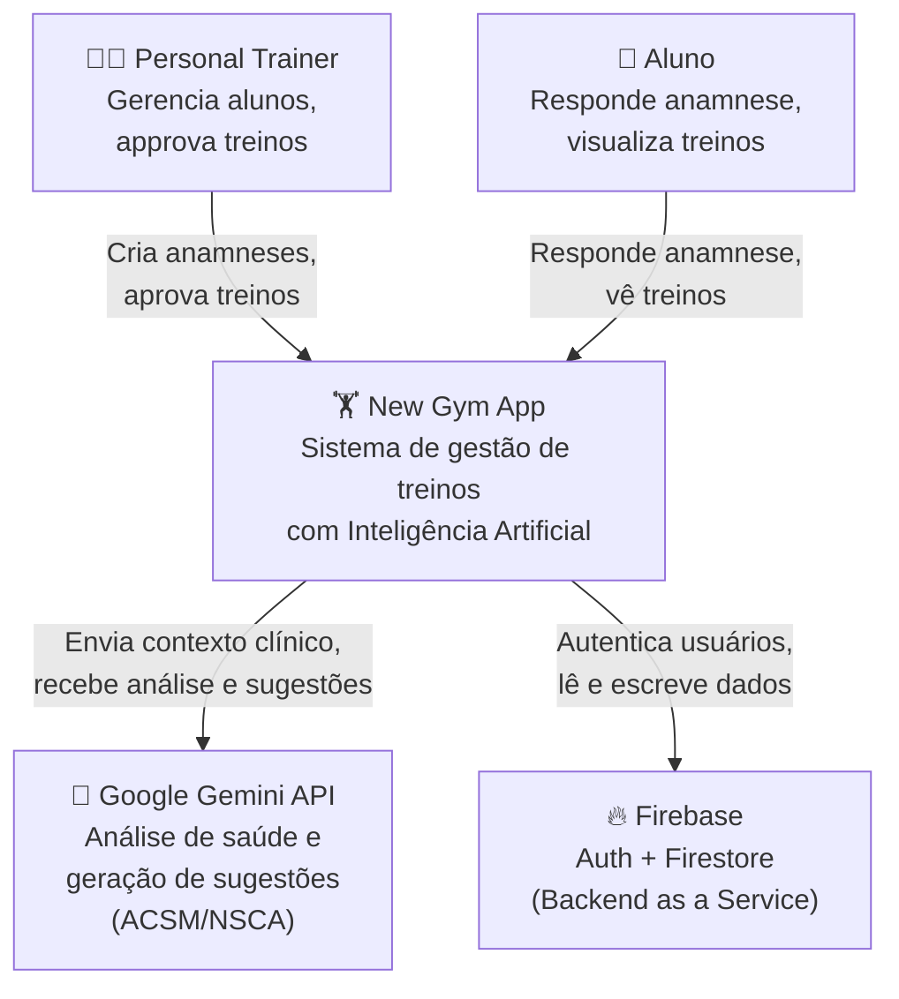
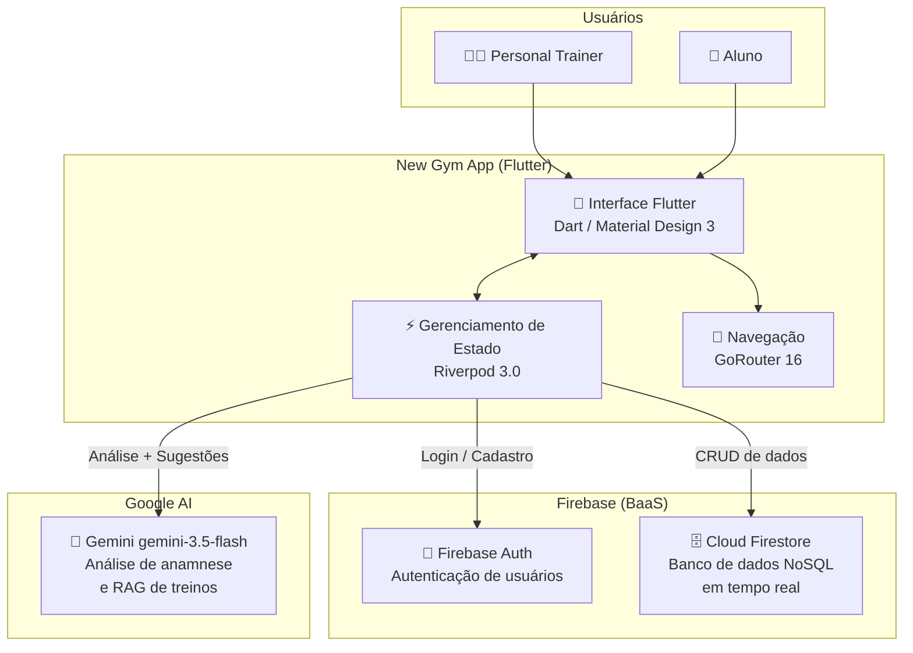
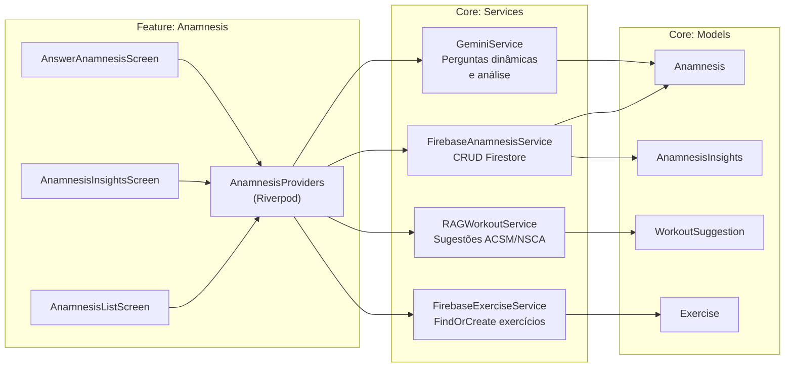
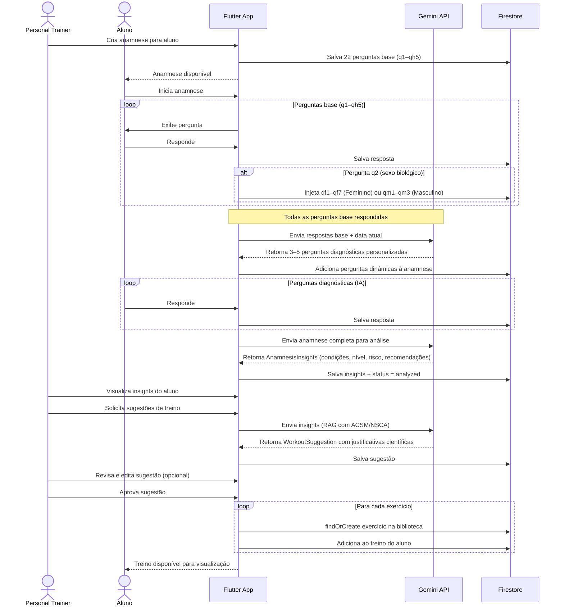
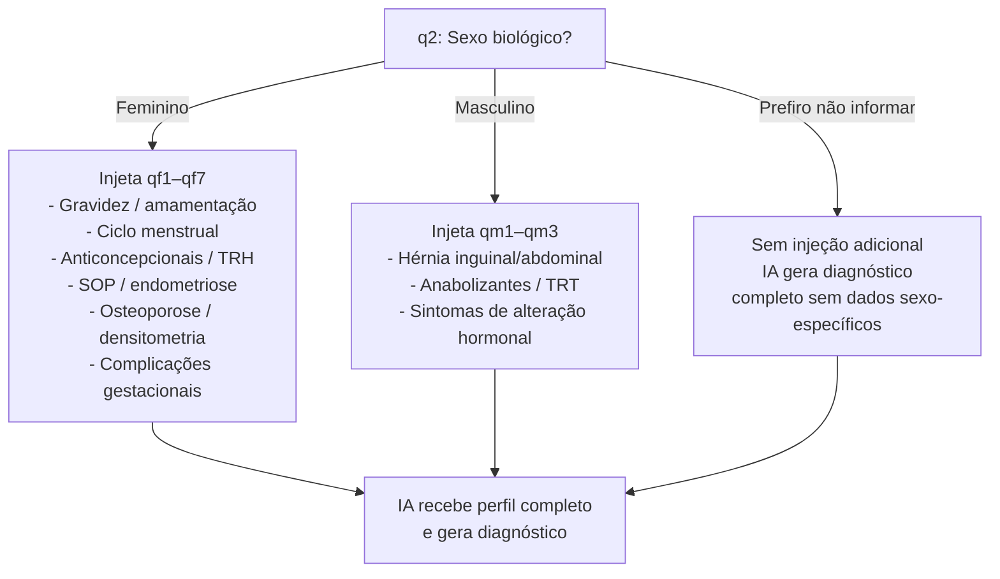
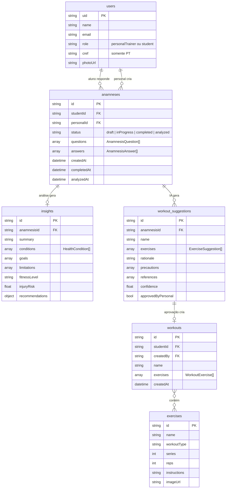
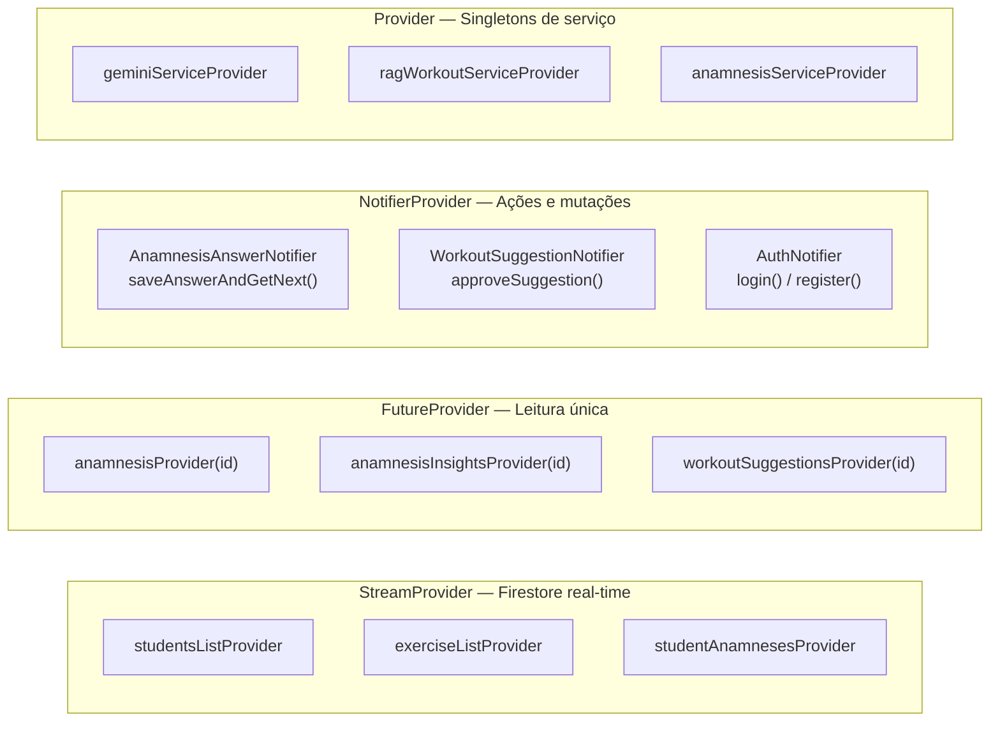

# Arquitetura do New Gym App

## Índice
- [Visão Geral do Sistema](#visão-geral-do-sistema)
- [C4 Model](#c4-model)
- [Arquitetura de Pastas](#arquitetura-de-pastas)
- [Fluxo da Anamnese com IA](#fluxo-da-anamnese-com-ia)
- [Modelo de Dados (Firestore)](#modelo-de-dados-firestore)
- [Gerenciamento de Estado](#gerenciamento-de-estado)
- [Decisões Arquiteturais](#decisões-arquiteturais)

---

## Visão Geral do Sistema

O New Gym App é uma aplicação Flutter com backend Firebase e integração com IA (Google Gemini). A arquitetura é organizada em **feature-first** com três camadas bem definidas: Presentation, Domain e Data.

---

## C4 Model

### Nível 1 — Contexto do Sistema



### Nível 2 — Containers



### Nível 3 — Componentes principais



---

## Arquitetura de Pastas

O projeto segue **Feature-First**: cada funcionalidade é um módulo independente com suas próprias telas, providers e lógica.

```
lib/
├── core/                          # Código compartilhado entre features
│   ├── config/
│   │   ├── app_router.dart        # Rotas declarativas (GoRouter)
│   │   └── app_theme.dart         # Tema Material Design 3
│   ├── models/                    # Entidades de domínio
│   │   ├── user_model.dart
│   │   ├── user_role.dart
│   │   ├── exercise_model.dart
│   │   ├── anamnesis_model.dart
│   │   ├── anamnesis_insights_model.dart
│   │   └── workout_suggestion_model.dart
│   ├── services/                  # Acesso a dados e APIs externas
│   │   ├── firebase_auth_service.dart
│   │   ├── firebase_anamnesis_service.dart
│   │   ├── firebase_exercise_service.dart
│   │   ├── firebase_workout_service.dart
│   │   ├── gemini_service.dart        # Análise de anamnese (IA)
│   │   └── rag_workout_service.dart   # Sugestões de treino (IA + RAG)
│   ├── shared_widgets/
│   │   ├── app_footer.dart        # Navegação inferior (role-aware)
│   │   └── user_avatar.dart       # Avatar com iniciais
│   └── utils/
│       └── anamnesis_template.dart  # Perguntas base + por sexo
│
├── features/
│   ├── auth/                      # Login e cadastro
│   ├── home/                      # Home diferente por role (PT vs aluno)
│   ├── anamnesis/                 # ⭐ Fluxo central do app
│   ├── students/                  # Gestão de alunos (PT)
│   ├── profile/                   # Perfil e troca de senha
│   └── exercise_detail/           # Biblioteca de exercícios
│
├── app.dart                       # MaterialApp.router + localizations
└── main.dart                      # Firebase init + ProviderScope
```

---

## Fluxo da Anamnese com IA

Este é o fluxo mais complexo do sistema, envolvendo injeção dinâmica de perguntas e duas chamadas à API Gemini.



### Injeção de Perguntas por Sexo Biológico



---

## Modelo de Dados (Firestore)



---

## Gerenciamento de Estado

O Riverpod 3.0 é utilizado com três tipos de providers conforme o caso de uso:



---

## Decisões Arquiteturais

### Feature-First vs Layered

A estrutura **feature-first** foi escolhida porque cada funcionalidade (anamnese, alunos, perfil) tem ciclo de vida independente. Adicionar ou remover uma feature equivale a adicionar ou remover uma pasta, sem impacto nas demais.

### Riverpod vs BLoC

| Critério | Riverpod | BLoC |
|---|---|---|
| Boilerplate | Mínimo | Alto |
| Curva de aprendizado | Baixa | Média |
| Compile-time safety | Sim | Sim |
| Integração com Firebase | Nativa | Manual |

### Firestore vs SQL

O Firestore foi escolhido por oferecer sincronização em tempo real nativa (necessária para o progresso da anamnese), suporte offline gratuito e ausência de infraestrutura de servidor para gerenciar — essencial para um projeto de TCC.

### IA: RAG sem biblioteca prévia

As sugestões de treino são geradas livremente pela IA com base em ACSM/NSCA, **sem depender de uma biblioteca de exercícios pré-existente**. Os exercícios só são persistidos no Firestore quando o personal trainer aprova uma sugestão, via `findOrCreateByName`. Isso elimina o problema de "lista vazia" e permite que a IA prescreva o exercício mais adequado sem restrições artificiais.

---

**Última atualização:** Junho 2026 | **Versão:** 1.0.0
